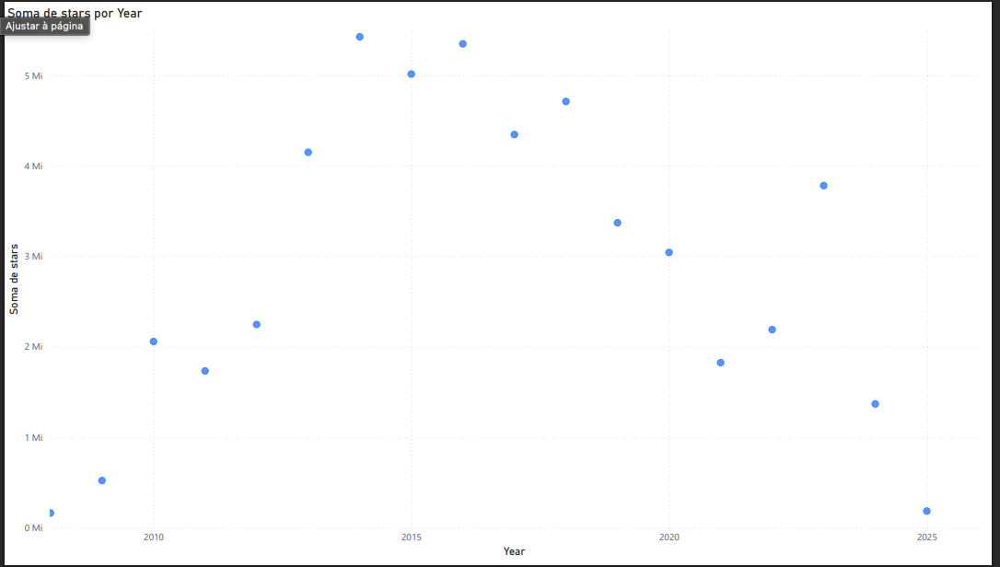
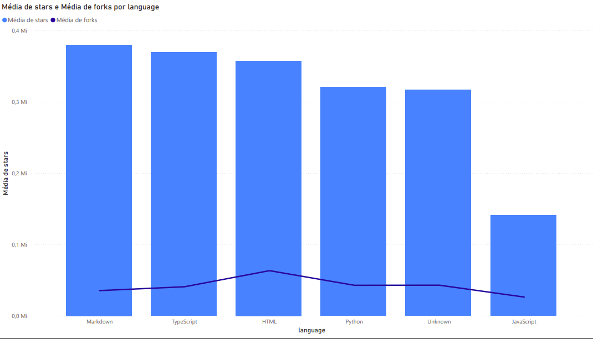
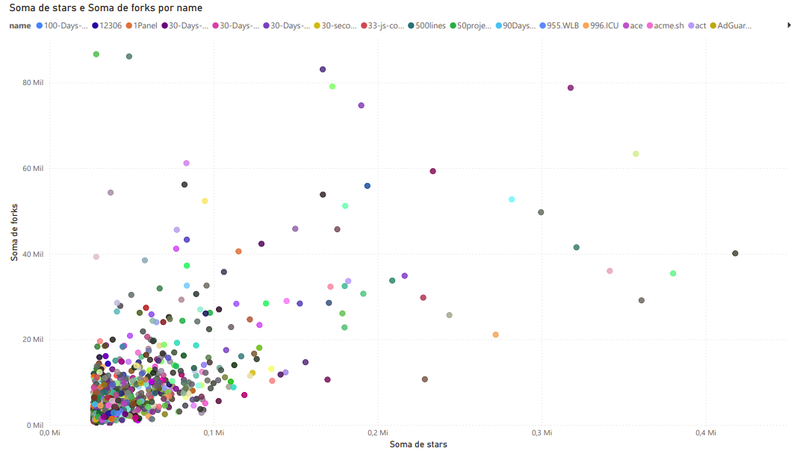
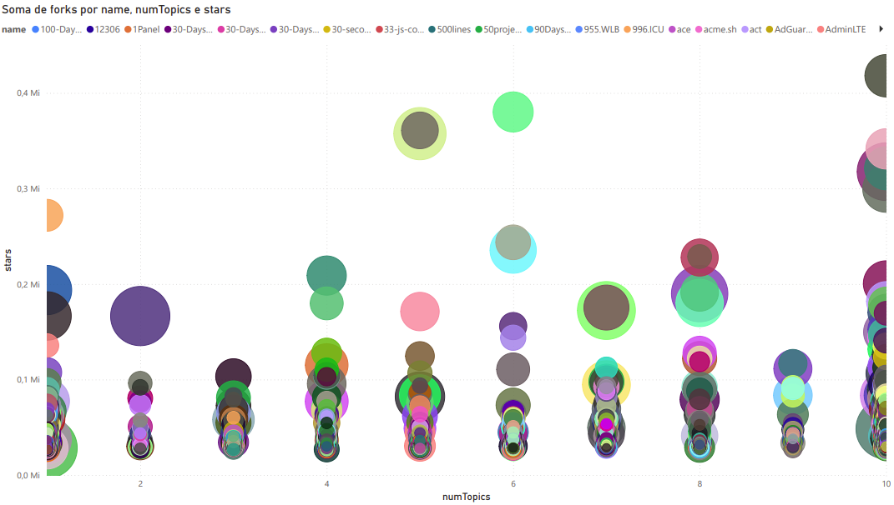
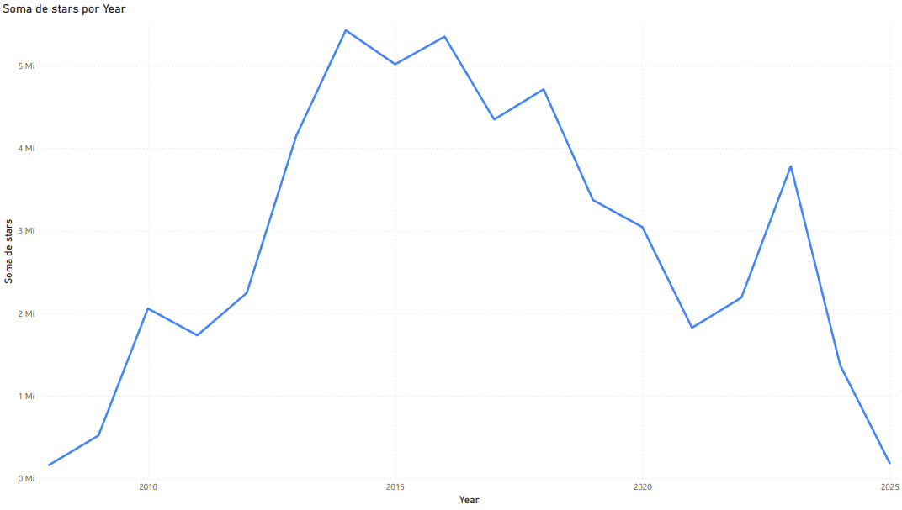

# Relatório de Análise de Dados

## Introdução

Neste trabalho, realizamos uma análise exploratória de dados com foco em repositórios populares do GitHub. A base de dados foi coletada utilizando a API GraphQL do GitHub, considerando os mil repositórios mais populares independentemente da linguagem. O objetivo é investigar padrões de popularidade, evolução temporal e características dos repositórios para responder a cinco perguntas de pesquisa (RQs), conforme modelo semelhante aos laboratórios anteriores (Lab01, Lab02 e Lab03).

## Metodologia

* **Coleta**: Utilizamos a API GraphQL do GitHub para coletar os 1000 repositórios mais populares, sem filtro de linguagem.
* **Transformação**: Os dados foram estruturados e exportados para um arquivo `.csv` compatível com o Power BI.
* **Visualização**: Construímos 5 gráficos no Power BI para responder às perguntas propostas.

Campos utilizados:

* `name`, `stars`, `forks`, `language`, `createdAt`, `updatedAt`, `topics`, `owner`, `license`, `description`

## Resultados

### RQ1 - Qual a evolução da popularidade dos repositórios ao longo dos anos?

**Gráfico:** Linha do tempo com soma de estrelas (stars) por ano de criação (`createdAt`).

**Insight:** A maior concentração de repositórios populares foi criada entre 2014 e 2018, indicando um período de grande atividade na comunidade open source.

---

### RQ2 - Qual é a média de estrelas e forks por linguagem?

**Gráfico:** Colunas agrupadas com linha (média de stars e forks por `language`).

**Insight:** Linguagens como Markdown e TypeScript têm repositórios altamente populares, enquanto JavaScript, apesar de muito usada, possui distribuição menos concentrada em poucos projetos.

---

### RQ3 - Quais tópicos estão associados aos repositórios com maior popularidade?

**Gráfico:** Dispersão com `topics` no eixo X e soma de `stars` no eixo Y.

**Insight:** Alguns tópicos como `30daysofpython` ou `ai` estão associados a repositórios altamente populares. A análise ajuda a identificar temas em alta na comunidade.

---

### RQ4 - Existe correlação entre o número de tópicos e a popularidade dos repositórios?

**Gráfico:** Dispersão com `numTopics` no eixo X e soma de `stars` no eixo Y, com tamanho das bolhas proporcional ao número de `forks`.

**Insight:** Há uma tendência de repositórios com mais tópicos receberem mais atenção, mas a correlação não é linear. Alguns repositórios com poucos tópicos também são muito populares.

---

### RQ5 - Como tem sido a atividade de atualizações ao longo dos anos?

**Gráfico:** Linha do tempo com soma de estrelas por ano de `updatedAt`.

**Insight:** Observa-se que muitos dos repositórios com alto número de estrelas continuam sendo atualizados ativamente, indicando manutenção ativa e relevância constante.

## Discussão

A análise permitiu observar padrões consistentes com a evolução das tecnologias e interesses da comunidade open source. Repositórios bem documentados, com temáticas atuais e maior variedade de tópicos tendem a atrair mais interesse. A linguagem influencia, mas fatores como tópico e frequência de atualizações são igualmente importantes para a popularidade.

## Conclusão

A Sprint 2 nos permitiu explorar visualmente características da base de repositórios mais populares do GitHub. As perguntas foram respondidas com apoio de visualizações no Power BI e o conjunto de gráficos pode auxiliar pesquisadores e desenvolvedores a entender tendências de interesse na plataforma.

---

**Próximos passos:** Caso deseje continuar, poderemos adicionar métricas de qualidade de software, ou explorar a relação entre contribuidores e popularidade.
